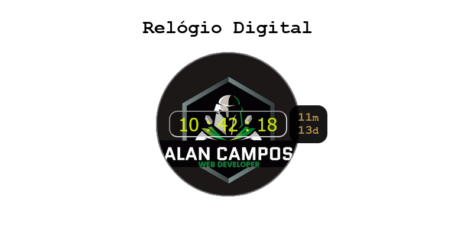
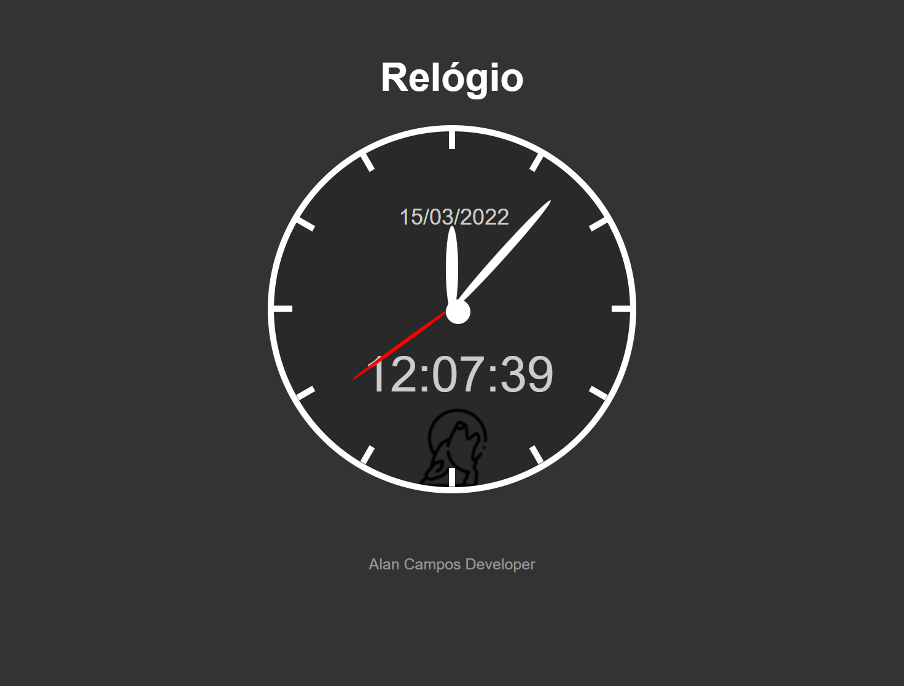

# Projeto de um Relógio Digital

esse projeto de estudo foi estruturado em **HTML5**, estilizado em **CSS3** e 

adicionado funcionalidades em **JavaScript** puro usando a função Date;

*Alan Campos - 13/11/2021*

* refatorei o projeto em 15/03/2022*  versão 2.0

